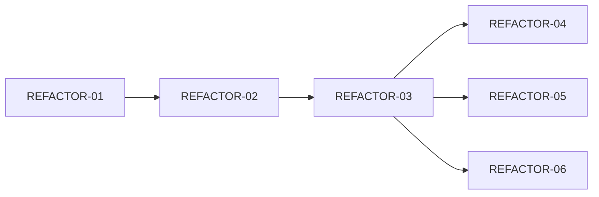

# 拆卡（Sprint Planning）

## 参与角色

PM + Design + Dev（含 Dev Lead）

## 目标

将阶段目标拆分为可执行的任务卡，每张卡片定义清晰的范围和验收标准。

## 卡片存储约定

- **目录**：项目根目录下的 `tasks/`
- **索引文件**：`tasks/README.md`（使用 `~/.claude/skills/team-flow/templates/tasks-readme-template.md` 模板）
- **卡片文件**：`tasks/<PREFIX>-<NN>.md`，`PREFIX` 用大写功能标签（`REFACTOR` / `FEAT` / `BUG` / `CHORE`），`NN` 两位数字零填充
- **新卡片模板**：`~/.claude/skills/team-flow/templates/card-template.md`（直接 cp 过来改）

## 卡片要素

每张任务卡必须包含：

| 字段 | 说明 | 负责人 |
|------|------|--------|
| **标题** | 简明描述做什么 | PM |
| **分类** | `visual` / `behavioral` / `structural`（决定 ③ 关卡的验证方式，详见 transitions.md） | PM + Dev |
| **任务需求** | 具体要实现的功能/改动 | PM |
| **交互方式** | 用户如何操作、页面如何响应 | Design + PM |
| **验收标准** | 可验证的完成条件（checklist 形式，必须使用 transitions.md 的证据语法） | PM + Design + Dev |
| **设计引用** | 指向设计规范的具体章节（如 `design/design.md §4.1`）。`visual` 卡必填，`behavioral` / `structural` 可选 | Design |
| **相关资源** | 设计稿链接、API 文档、依赖说明 | Design + Dev |
| **依赖** | 阻塞本卡的其他卡片 ID，或"无" | Dev Lead |
| **优先级** | P0/P1/P2/P3 | PM |
| **执行者** | 分配给哪个开发 | Dev Lead |

## 验收标准写法

好的验收标准是**可验证的**，不是模糊描述：

```
// 差
- 页面加载要快

// 好
- 首屏加载时间 < 2s（debug-kit perf 命令可测量）
- 点击「提交」按钮后显示成功提示（debug-kit screenshot 可验证）
- 输入为空时「提交」按钮禁用（debug-kit tap + screenshot 可验证）
```

## 拆卡原则

- **单一职责**：一张卡只做一件事，避免"顺便改一下"
- **可独立验收**：不依赖其他未完成的卡就能验证
- **粒度适中**：1-3 天可完成，太大则继续拆分
- **依赖显式化**：如果依赖其他卡，在卡片中标注并设置 BLOCK 关系

## 依赖图

`tasks/README.md` 里的索引表记录每张卡的"依赖"列。当卡片数 ≥ 5 时，**必须**额外在 README 里附一个 mermaid 依赖图，直观呈现并行/串行关系：



拆卡时由 Dev Lead 检查依赖图：
- 无环（不允许 A → B → A）
- 无"孤岛"（所有卡最终能追溯到至少一张根卡）
- 关键路径合理（P0 卡不应被 P2 卡阻塞）

## 拆卡完成标志

- 所有卡片状态为 **PLAN**
- 每张卡的验收标准、交互方式、相关资源齐全
- `visual` 卡均有"设计引用"章节指向
- 卡片数 ≥ 5 时依赖图已绘制且无环
- 团队三方（PM/Design/Dev）无异议
- **建议池回流**：本次拆卡过程中有哪些被明确"不纳入本阶段"的想法？PM 必须把它们写入 `proposals/` 池（参考 `references/proposals.md`），避免遗忘
- 完成后 PM 按 `references/transitions.md` 的"批量转移规则"将整批卡片从 PLAN 转为 TODO
